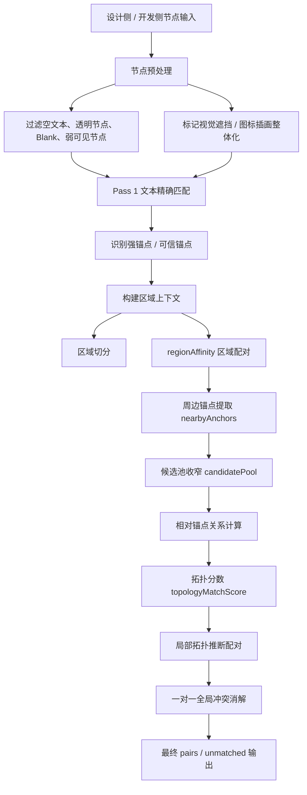

# 局部拓扑强锚点实现细节

> 目标：说明当前节点匹配中“强锚点 + 周边节点”的局部拓扑推断是怎么实现的。

这套机制的核心不是单点文本匹配，而是先找到少量高置信锚点，再利用锚点周围的相对位置关系，去推断其它弱节点的对应关系。它主要用于解决：

- 重复列表项中的串位问题
- 同风格卡片中的辅助文本漏配
- 文本内容不同但布局角色相同的节点
- 局部区域结构相似、但单点语义不足的情况

相关实现主要分布在：

- `server/src/matchers/nodeMatcher.js`
- `server/src/matchers/matchStrategies.js`
- `server/src/matchers/regionContext.js`
- `server/src/matchers/textSemantics.js`

## 0. 流程图

---

## 1. 这条链路的整体位置

当前匹配流程不是一次性完成的，而是分层推进：

1. 先做文本精确匹配，拿到高置信文本对。
2. 再做动态槽位、区域最优、语义角色等文本匹配。
3. 把已经稳定命中的文本对当作锚点。
4. 用这些锚点去推断周边节点的拓扑关系。
5. 最后做一对一冲突消解。

也就是说，局部拓扑不是第一步，而是建立在“已有可靠锚点”的基础上的增强阶段。

---

## 2. 锚点从哪里来

### 2.1 文本精确匹配产生强锚点

在 `nodeMatcher.js` 的 Pass 1 中，会先做同文本匹配。满足以下条件的节点更容易成为锚点：

- 文本完全相同
- 两侧都可匹配
- 位置距离不大
- 样式相似度高
- 不属于短数字、弱可见、重复高风险文本

命中的 pair 会被放进 `strongAnchors` 或 `topologyAnchors` 体系里。

### 2.2 可信锚点判定

不是所有文本命中都能当锚点。

在 `nodeMatcher.js` 里，`isTrustedTopologyAnchor(pair, dist, score)` 负责收口：

- 设计侧和开发侧都必须是文本
- 文本内容归一化后必须一致
- 如果 pair 本身就是强锚点，直接通过
- 否则需要满足较高的匹配分数
- 并且中心距离不能太大

这一步很重要，因为拓扑推断依赖锚点，如果锚点不稳，后面的周边节点会一起漂。

---

## 3. 区域上下文先行

局部拓扑不是在全页面里乱搜，而是先给页面切出区域上下文。

### 3.1 区域切分

`regionContext.js` 里的 `segmentRegions()` 会先把节点按纵向分段，必要时会结合视觉分区、固定楼层分区来辅助切分。

它的目的不是做精细布局分析，而是先把页面切成相对独立的局部块，减少拓扑搜索范围。

### 3.2 区域配对

`buildRegionContext(designRegions, arkuiRegions, anchors, visualFeatures)` 会根据：

- 区域中心位置
- 区域高度
- 文本集合
- 装饰密度
- 锚点投票
- 视觉特征相似度

去构建设计区和开发区之间的区域配对。

区域匹配完成后，`designNodeToRegion` 和 `arkuiNodeToRegion` 就能把每个节点映射到具体区域。

### 3.3 区域亲和力

`regionAffinity(designNode, arkuiNode, regionContext)` 会返回两个节点所在区域的配对得分。

这个分数后面会被加到：

- 区域内文本最优匹配
- 文本位置回退
- 锚点拓扑匹配
- 一些视觉/几何兜底匹配

里，作为局部上下文加成。

---

## 4. 周边锚点怎么找

### 4.1 `nearbyAnchors()`

真正进入局部拓扑搜索前，会先为每个待匹配节点找“附近的锚点”。

入口在 `matchStrategies.js` 的 `nearbyAnchors(node, anchors, side)`。

它的逻辑分两类：

#### 非短中文标签节点

如果节点不是短中文标签：

- 先找最近的锚点
- 只保留中心距离小于 `0.35` 的那个锚点

这样做的原因是，普通节点通常只有一个最有代表性的参照点。

#### 短中文标签节点

如果节点是短中文标签：

- 不只看最近一个
- 会取多个近邻锚点
- 允许距离放宽到 `0.70`
- 最多保留 6 个

这是因为短标签更容易出现在重复列表、菜单、信息块里，单锚点不足以稳定定位。

---

## 5. 拓扑匹配的核心实现

### 5.1 候选节点先收窄

`matchByAnchorTopology(designNodes, arkuiNodes, anchors, usedArkui, matchedDesignIds, regionContext)` 是主入口。

它先做这些过滤：

- 只看还没匹配的设计节点
- 只看 `isMatchableNode()` 通过的节点
- 文本节点还要满足 `hasUsableText()`
- 给每个设计节点找到附近锚点
- 如果没有锚点，就不进入拓扑匹配

这一步保证局部拓扑只服务于“已经有上下文”的节点。

### 5.2 候选池限制在区域内

对于每个设计节点，会调用 `candidatePool()`。

这个池子的优先顺序是：

1. 同区域的开发节点
2. 如果区域内没有足够候选，再回落到全局候选

这样做可以让拓扑推断优先在局部视觉块内完成，而不是跨区域误配。

### 5.3 以锚点关系为参照

对某个设计节点 `dn`，会拿它关联到的每个锚点 `anchor`：

- 计算 `dn` 相对设计锚点的关系：`relationToAnchor(dn, anchor.pair.design)`
- 计算候选开发节点 `an` 相对开发锚点的关系：`relationToAnchor(an, anchor.pair.arkui)`

`relationToAnchor()` 返回的是一个相对关系向量：

- `dx`
- `dy`
- 节点自身的 `w`
- 节点自身的 `h`

也就是说，拓扑判断不是绝对坐标，而是“相对锚点的偏移关系”。

### 5.4 关系距离先筛一轮

`distanceBetweenRelations(a, b)` 用欧氏距离比较两个关系向量。

如果设计侧关系和开发侧关系差太大，直接跳过。

当前门槛是：

- `distanceBetweenRelations(...) > 0.24` 就不再深入

这一步是第一道硬门，作用是迅速砍掉明显不合理的候选。

### 5.5 `topologyMatchScore()` 打分

通过第一道门后，会进入 `topologyMatchScore(dn, an, designRelation, arkuiRelation, regionContext)`。

这个分数不是只看一个维度，而是组合了多个信息：

#### 1. 相对关系相似度

- 用 `relDist = distanceBetweenRelations(...)`
- 转换为 `relScore = 1 - relDist / 0.22`

这是最核心的拓扑分数。

#### 2. 尺寸相似度

- 宽高分别做 `sizeRatio`
- 再平均得到 `sizeScore`

用途：

- 防止同位置但大小不对的节点互配
- 区分标题、标签、图标、说明文本等不同角色

#### 3. 类型一致性

- 同类型记满分
- 不同类型给较低分

用途：

- 防止文本节点和图形节点互相抢位

#### 4. 文本样式相似度

文本节点会额外计算 `textStyleSimilarity()`。

用途：

- 同样是短文本时，通过字体、字重、颜色等继续缩小范围

#### 5. 文本语义与角色

文本节点还会计算：

- `textSemanticSimilarity()`
- `textRoleMatchScore()`

如果是短中文标签，还会允许特殊的槽位兼容逻辑。

#### 6. 区域亲和力

最后再加上 `regionAffinity()`。

这一步相当于告诉算法：

“这两个节点不仅长得像、位置像，它们还在已配好的同一局部区域里。”

### 5.6 最终公式

当前拓扑得分大致是：

- `relScore * 0.38`
- `sizeScore * 0.18`
- `typeScore * 0.10`
- `textScore * 0.10`
- `semanticScore * 0.14`
- `iou * 0.06`
- `regionScore * 0.04`

这个权重分布体现了当前策略：

1. 相对位置最重要
2. 尺寸和语义次之
3. 区域上下文和 IoU 作为补充

---

## 6. 文本节点的特殊收口

局部拓扑里，文本节点比图形节点更敏感，所以额外加了几层门槛。

### 6.1 语义门槛

如果文本语义门槛不通过，且角色分数不够高，就直接返回 0 分。

但如果是短中文标签，并且满足 `isTopologySlotCompatible()`，则允许作为槽位兼容候选。

### 6.2 短单位和短数字特殊约束

如果节点是：

- 短单位文本
- 短数字文本

就会加更严格的位置条件。

例如：

- 短单位文本必须满足中心纵向距离要求
- 短数字必须满足 `isNearSameLineSlot()`

这样可以避免局部拓扑把“看起来像数字”的远距离节点硬配到一起。

### 6.3 短中文标签槽位兼容

`isTopologySlotCompatible(dn, an, relDist, roleScore)` 专门给短中文标签做兼容。

它要求：

- 相对关系距离不能太大
- 样式相似度足够高
- 高度比例不能太离谱
- 横向偏差不能太大
- 纵向偏差也不能太大，除非角色分数很高

这条规则比较像“局部版槽位匹配”，适合卡片上的短标签、按钮文案、列表项标签等。

---

## 7. 拓扑锚点为什么有效

这套机制之所以有效，是因为很多页面的局部结构比文本值更稳定。

例如一个卡片里：

- 左上角是标题
- 右上角是时间
- 中间是状态
- 底部是说明

即使设计稿和开发侧文案不同，只要其中一个或两个高置信锚点能对上，周边节点的位置关系就能把其它文本推回来。

所以局部拓扑本质上是在做：

> “相对位置关系的复制，而不是绝对坐标的复制。”

---

## 8. 和区域最优匹配的关系

局部拓扑不是单独存在的，它和区域最优匹配互相配合。

### 8.1 区域最优先出锚点

先有区域内最优文本匹配，才更容易形成稳定锚点。

### 8.2 锚点再反哺拓扑

一旦锚点建立，局部拓扑就能更稳定地判断周边节点。

### 8.3 拓扑结果再反向增强锚点集合

如果一个拓扑 pair 的 `topologyScore` 足够高，也会被补充进 `topologyAnchors`。

这样后续节点可以继续利用这些新的局部强点。

这其实形成了一个小型的正反馈闭环：

1. 精确匹配出锚点
2. 锚点推断周边节点
3. 周边高置信结果再变成新锚点
4. 继续扩散

---

## 9. 一对一约束怎么收口

即使局部拓扑找到很多候选，最终也不能破坏全局一对一。

所以最后还要走：

- `selectOneToOnePairs()`

它会根据 `pairPriority()` 排序，优先保留：

1. 高置信 pair
2. 锚点 pair
3. 类型更稳的 pair
4. 拓扑分更高的 pair

然后再去掉已经占用的 design / arkui 节点。

这一步很重要，因为局部拓扑容易产生“多个节点都觉得自己和锚点很像”的情况，必须靠最终收口解决冲突。

---

## 10. 当前实现的优点

这套实现目前比较稳定的地方主要有：

- 能利用已有高置信节点继续扩展匹配
- 对重复列表、卡片、分组布局很有效
- 不依赖单一文本值
- 兼容语义不同但布局角色相同的节点
- 通过区域上下文降低全局误配
- 通过一对一消解避免拓扑结果爆炸

---

## 11. 当前实现的边界

这套机制也有明确边界：

- 如果锚点本身不准，周边推断会被带偏
- 页面太扁平、没有明显局部结构时，拓扑收益会下降
- 纯装饰节点、弱可见节点、透明节点不适合靠拓扑硬救
- 过远的节点不能因为“相对结构像”就放宽

所以它必须建立在强过滤和高置信锚点的前提上。

---

## 12. 一句话总结

局部拓扑这套实现，本质上是把“节点和锚点之间的相对关系”当成匹配特征，再结合区域上下文、语义类型、尺寸比例和一对一约束，完成对周边节点的稳健推断。

它的价值不是替代文本匹配，而是把已经可靠的锚点变成局部结构的坐标系。
