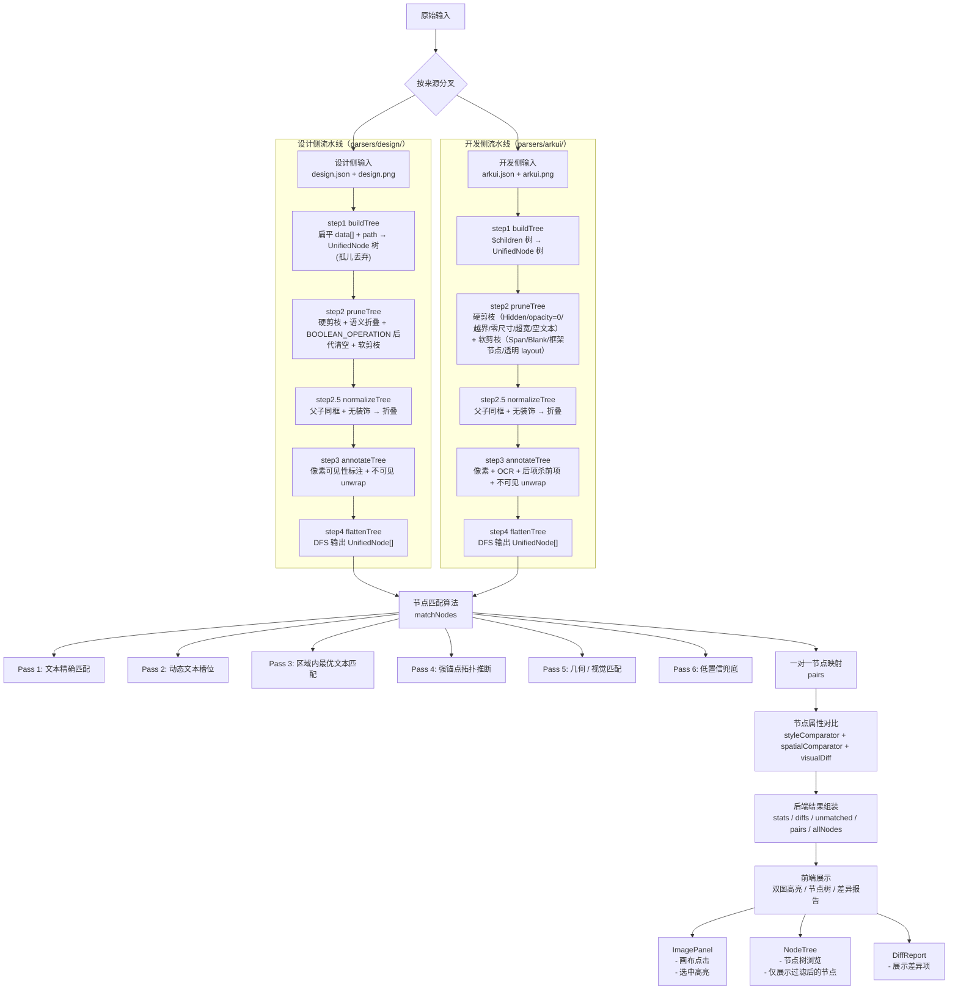

# 数据流结构图

下面这张图描述的是当前工程的真实数据流结构。重点是：

- 解析阶段重构为 **5 步流水线**（两侧对称）：build → prune → normalize → annotate → flatten
- 像素 / OCR / 后项杀前项 标注以及不可见节点剔除全部内化进 step 3，不再由 `runCheck` 单独调用
- `paintIndex` 概念已删除；`pruneOccludedSiblings`（后项杀前项）已实装，直接剪枝不挂标注，step 3 最先运行

## 阶段输入输出明细

### 1. 原始输入阶段

- 输入：
  - 设计侧 `design.json` + 可选 `design.png`
  - 开发侧 `arkui.json` + 可选 `arkui.png`
- 输出：进入解析流水线的 JSON 对象和图片 Buffer

### 2. 解析流水线阶段

每侧入口都是 `async`：

- `parseDesign(designJson, { imageBuffer })` → `{ canvasWidth, canvasHeight, nodes, annotateStats, _root }`
- `parseArkui(arkuiJson, { imageBuffer })` → `{ canvasWidthVp, canvasHeightVp, resolution, nodes, annotateStats, _root }`

`nodes` 即扁平 `UnifiedNode[]`，已完成下列内化处理，直接喂给 `matchNodes`：

| step | 子操作 | 备注 |
|---|---|---|
| 1 buildTree | 结构转换 + 字段统一 | 不剔除任何节点 |
| 2 pruneTree | 硬剪枝（整棵子树删）+ 软剪枝（删自身保子） | 两侧规则略有差异，详见 [进入节点匹配前原始数据处理流程.md](./进入节点匹配前原始数据处理流程.md) |
| 2.5 normalizeTree | 父子同框 + 无装饰 → 折叠 | 两侧共享 `utils/normalizeTree.js` |
| 3 annotateTree | 兄弟遮挡剪枝 + 像素标注 + OCR 标注 + 不可见 unwrap | ArkUI：后项杀前项（reverse）；设计侧：前项杀后项（forward）。各步独立，不依赖标注字段 |
| 4 flattenTree | 树 → 扁平数组（DFS 顺序），去掉内部字段 | 不包含 root 节点本身 |

### UnifiedNode 关键字段

| 字段 | 说明 |
|---|---|
| `id` | 唯一标识。设计侧来自 `guid`，开发侧来自 `$ID`（缺失时 fallback 到 `arkui:<path>`） |
| `source` | `'design'` / `'arkui'` |
| `type` | `'text'` / `'container'` |
| `rawType` | 原始类型小写（Figma 原始 type 或 ArkUI `$type`） |
| `name` | 节点名（设计）或组件类型（开发） |
| `path` | 树路径数组（开发侧来自递归路径；设计侧来自 raw `path`） |
| `rect` | `{ x, y, w, h }`，设计侧为 dp，开发侧为 vp |
| `normRect` | 同 `rect`，按画布尺寸 0-1 归一化 |
| `visible` | `state.visible !== false` 的镜像 |
| `style` | 已规范化的样式字段集合（详见处理流程文档） |
| `textContent` | 文本节点的内容（HM Symbol 文本不挂） |
| `semanticAsset` | 设计侧语义资产标志 |
| `pixelVisibility` / `pixelInvisible` | step 3 像素采样结果 |
| `ocrVisibility` | step 3 OCR 结果（仅开发侧文本节点） |
| `visualOccluded` / `visualOcclusionReason` | 已不再由 step 3 写入；后项杀前项改为直接剪枝，不挂此字段 |

> 注：`paintIndex` 字段已废弃，不再赋值。下游 `?? 0` 兜底退化为按 DFS 序排序。
> `hiddenFrameworkAncestor` 字段在新架构下不再被设置，相关分支判断自动失效。

### 3. 节点匹配阶段

- 输入：`designResult.nodes`、`arkuiResult.nodes`、`primarySource`、可选 `visualImages`
- 输出：`pairs` / `unmatchedDesign` / `unmatchedArkui` / `comparableDesignCount` / `comparableArkuiCount` / `regions`
- `pairs` 中每一项包含：`design` / `arkui` / `matchType` / `confidence` / `iou` / `topologyScore` / `visualScore` / `regionScore`

### 4. 节点对比阶段

- 输入：`pairs`
- 输出：`diffs[]`，每项含 `property` / `designValue` / `arkuiValue` / `severity` / `description` / `designNodeId` / `arkuiNodeId`
- 对比内容：`styleComparator` + `spatialComparator`

### 5. 后端结果组装阶段

- 输出：`{ caseId, duration, stats, canvas, regions, diffs, pairs, allDesignNodes, allArkuiNodes, unmatchedDesignNodes, unmatchedArkuiNodes }`

### 6. 前端展示阶段

- 左侧 case / 上传入口
- 中间双图高亮（`ImagePanel`）
- 右侧节点树（`NodeTree`）和差异报告（`DiffReport`）

## 关键说明

1. **不可见节点剔除发生在解析流水线 step 3 内**：被剔除的节点不会进入 `matchNodes()`，也不会进入 `pairs` / `diffs` / `unmatched` / 节点树。
2. **开发侧文本兜底**：`textContent = content || accessibilityText`，在 step 1 buildTree 内完成。
3. **OCR 只对开发侧生效**：设计侧文字内容来自 JSON，无需 OCR 验证。
4. **前端只负责展示**：所有过滤判断都在后端解析流水线和 match 阶段完成。

## 对应代码

- 开发侧解析流水线：[server/src/parsers/arkui/](../server/src/parsers/arkui/)
  - `buildTree.js` / `pruneTree.js` / `annotateTree.js` / `flattenTree.js` / `index.js`
- 设计侧解析流水线：[server/src/parsers/design/](../server/src/parsers/design/)
- 共用就地规整：[server/src/utils/normalizeTree.js](../server/src/utils/normalizeTree.js)
- 像素 / OCR 标注：[server/src/utils/imageFeatures.js](../server/src/utils/imageFeatures.js)、[server/src/utils/textOcrVisibility.js](../server/src/utils/textOcrVisibility.js)
- 可见性判定函数（`isPipelineVisibleNode` 等）：[server/src/matchers/nodeVisibility.js](../server/src/matchers/nodeVisibility.js)
- 匹配算法：[server/src/matchers/nodeMatcher.js](../server/src/matchers/nodeMatcher.js)
- 样式对比：[server/src/comparators/styleComparator.js](../server/src/comparators/styleComparator.js)
- 主流程：[server/src/routes/check.js](../server/src/routes/check.js)
- 前端入口：[client/src/App.vue](../client/src/App.vue)
