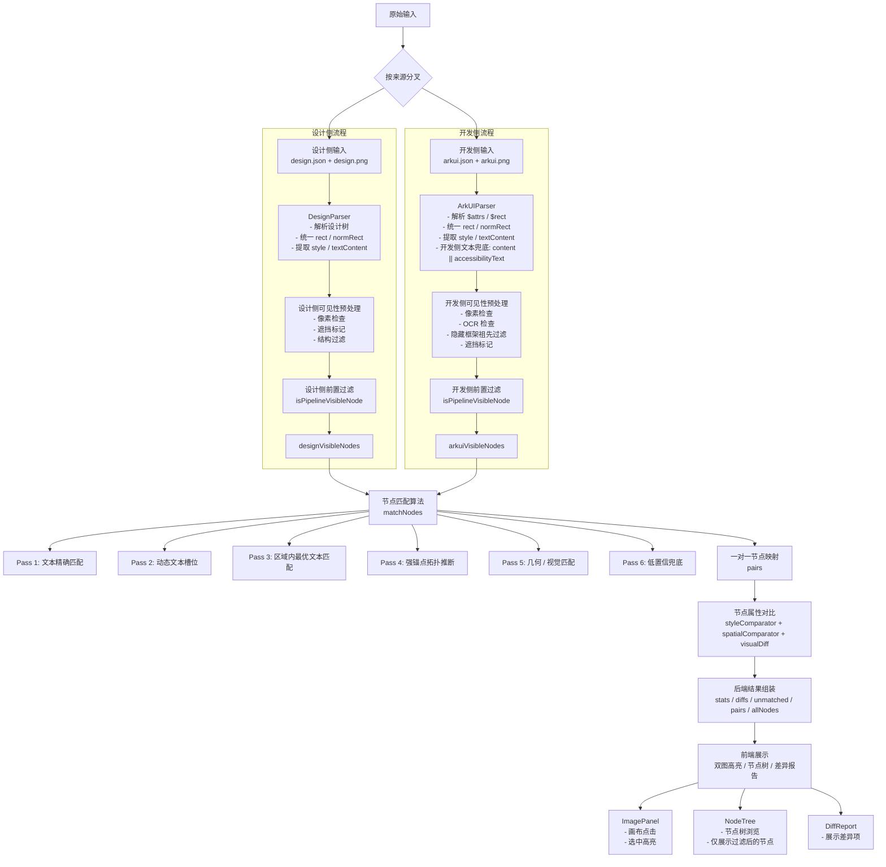

# 数据流结构图

下面这张图描述的是当前工程的真实数据流结构。重点是：

- 前期过滤后的节点，不再进入后续匹配、对比和展示结果
- 开发侧 `Text` 节点会先做内容兜底收集，再进入可见性过滤
- OCR 只参与开发侧主流程的文本过滤判断

## 阶段输入输出明细

### 1. 原始输入阶段

- 输入：
  - 设计侧 `design.json`
  - 设计侧 `design.png`
  - 开发侧 `arkui.json`
  - 开发侧 `arkui.png`
- 输出：
  - 进入解析器的原始 JSON 对象
  - 进入像素 / OCR 检测的图片 Buffer

### 2. 解析与归一化阶段

- 设计侧输入：
  - `design.json`
- 设计侧输出：
  - `designResult.nodes`
  - 每个节点统一成 `UnifiedNode`
  - 关键字段包括：
    - `id`
    - `type`
    - `name`
    - `rect`
    - `normRect`
    - `style`
    - `textContent`
    - `path`
    - `paintIndex`

- 开发侧输入：
  - `arkui.json`
- 开发侧输出：
  - `arkuiResult.nodes`
  - 每个节点统一成 `UnifiedNode`
  - 关键字段包括：
    - `id`
    - `type`
    - `rawType`
    - `name`
    - `rect`
    - `normRect`
    - `style`
    - `textContent`
    - `path`
    - `paintIndex`
    - `hiddenFrameworkAncestor`

- 开发侧文本内容收集规则：
  - `content || accessibilityText`
  - 这是为了保留内容字段为空、但可访问文本存在的节点

### 3. 可见性预处理阶段

- 设计侧输入：
  - `designResult.nodes`
  - `design.png`
- 设计侧输出：
  - 每个节点上的：
    - `pixelVisibility`
    - `pixelInvisible`
    - `visualOccluded`
    - `visualOcclusionReason`
  - 设计侧主要用于像素可见性和遮挡判断

- 开发侧输入：
  - `arkuiResult.nodes`
  - `arkui.png`
- 开发侧输出：
  - 每个节点上的：
    - `pixelVisibility`
    - `pixelInvisible`
    - `ocrVisibility`
    - `visualOccluded`
    - `visualOcclusionReason`
    - `hiddenFrameworkAncestor`
  - OCR 会自动参与开发侧文本节点过滤

### 4. 前置过滤阶段

- 输入：
  - 已完成可见性预处理的设计侧 / 开发侧节点
- 输出：
  - `designVisibleNodes`
  - `arkuiVisibleNodes`
- 过滤结果：
  - 不满足 `isPipelineVisibleNode()` 的节点不会继续进入后续流程
  - 这些节点不会再参与匹配、对比、统计和前端展示

### 5. 节点匹配阶段

- 输入：
  - `designVisibleNodes`
  - `arkuiVisibleNodes`
  - `visualImages`（可选，来自设计侧 / 开发侧截图）
  - `primarySource`
- 输出：
  - `pairs`
  - `unmatchedDesign`
  - `unmatchedArkui`
  - `comparableDesignCount`
  - `comparableArkuiCount`
  - `regions`

- `pairs` 中每一项通常包含：
  - `design`
  - `arkui`
  - `matchType`
  - `confidence`
  - `iou`
  - `topologyScore`
  - `visualScore`
  - `regionScore`

### 6. 节点对比阶段

- 输入：
  - `pairs`
- 输出：
  - `diffs`
  - 每个 diff 包含：
    - `property`
    - `designValue`
    - `arkuiValue`
    - `severity`
    - `description`
    - `designNodeId`
    - `arkuiNodeId`

- 对比内容包括：
  - 样式对比：`styleComparator`
  - 空间关系对比：`spatialComparator`
  - 视觉差异对比：`visualDiff`

### 7. 后端结果组装阶段

- 输入：
  - `pairs`
  - `diffs`
  - `unmatchedDesign`
  - `unmatchedArkui`
  - `designVisibleNodes`
  - `arkuiVisibleNodes`
  - 统计指标
- 输出：
  - `stats`
  - `canvas`
  - `regions`
  - `diffs`
  - `pairs`
  - `allDesignNodes`
  - `allArkuiNodes`
  - `unmatchedDesignNodes`
  - `unmatchedArkuiNodes`

### 8. 前端展示阶段

- 输入：
  - 后端返回的完整分析结果对象
- 输出：
  - 左侧 case / 上传入口
  - 中间双图高亮
  - 右侧节点树
  - 右侧差异报告

## 关键说明

1. 过滤发生在匹配之前。
   - 被过滤的节点不会进入 `matchNodes()`。
   - 也不会进入 `pairs`、`diffs`、`unmatched` 和节点树。

2. 开发侧文本收集规则是：
   - `content || accessibilityText`
   - 这是为了保留类似 `id=1261` 这种 `content` 为空、但 `accessibilityText` 有值的文本节点。

3. OCR 是开发侧主流程的一部分。
   - 它不是单独的附加功能。
   - 它已经融入开发侧过滤阶段，参与决定节点是否进入后续匹配和展示。
   - OCR 只对开发侧生效，设计侧不走 OCR 过滤。

4. 前端主要负责展示。
   - 规则判断尽量在后端完成。
   - 前端的节点选择、树展示和高亮，都基于后端已经过滤好的结果。

## 对应代码

- [server/src/parsers/designParser.js](/Users/user1/Desktop/workspace/style_checker/server/src/parsers/designParser.js)
- [server/src/parsers/arkuiParser.js](/Users/user1/Desktop/workspace/style_checker/server/src/parsers/arkuiParser.js)
- [server/src/utils/imageFeatures.js](/Users/user1/Desktop/workspace/style_checker/server/src/utils/imageFeatures.js)
- [server/src/utils/textOcrVisibility.js](/Users/user1/Desktop/workspace/style_checker/server/src/utils/textOcrVisibility.js)
- [server/src/matchers/nodeVisibility.js](/Users/user1/Desktop/workspace/style_checker/server/src/matchers/nodeVisibility.js)
- [server/src/matchers/nodeMatcher.js](/Users/user1/Desktop/workspace/style_checker/server/src/matchers/nodeMatcher.js)
- [server/src/comparators/styleComparator.js](/Users/user1/Desktop/workspace/style_checker/server/src/comparators/styleComparator.js)
- [server/src/routes/check.js](/Users/user1/Desktop/workspace/style_checker/server/src/routes/check.js)
- [client/src/App.vue](/Users/user1/Desktop/workspace/style_checker/client/src/App.vue)
